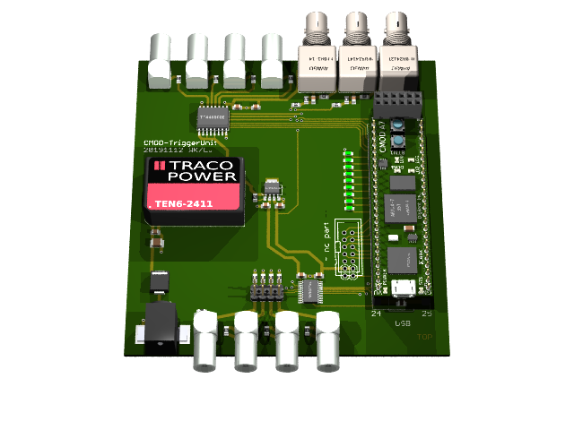
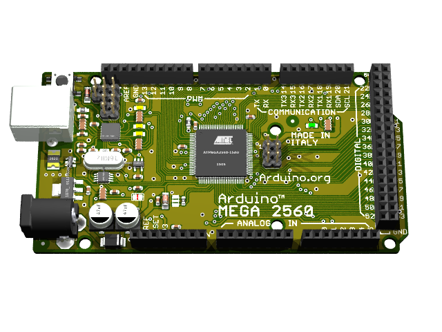
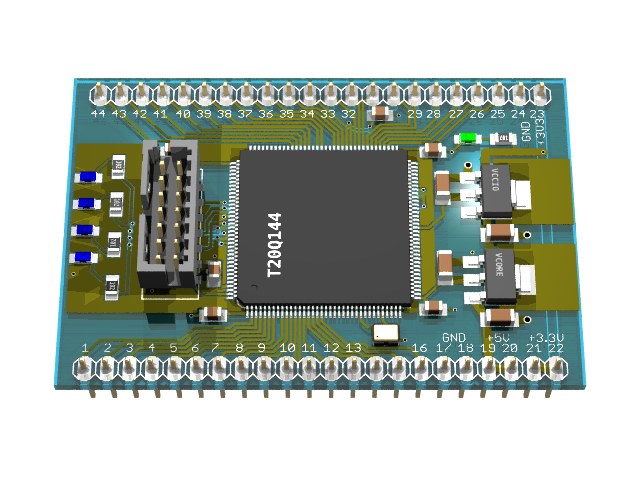

# Eagle3D

Hi,

Do you still remember that famous idea of rendering PCB 3D images using Cadsoft EAGLE, an ulp script file and povray as raytracer?
It was, and still is, an eye catcher.

Well, years have been passed by..

The upstream of Eagle3D (www.matwei.de) has been gone a while ago.
The project was later moved to berliOS („Berlin Open Source“), where it seems to be now gone as well.
There's still a working sourceforge mirror (https://sourceforge.net/projects/eagle3d.berlios/),
but file browsing doesnt work and the rendered preview png images are missing.

This one is my personal copy of this beautiful project - just to enshure it's not been lost.
I will add file by file from somewhere in past to preserve a working copy - but may be not the very latest one. While doing so, create some basic install instructions.

Some files might have been edited for some reason in past. I don't know.
For shure, there are some parts, which have been added by me - if i was interested enough to have them.
Or, existing ones modified by me, for my personal use. If you can find a newer source, choose that one.

The structure here doesnt fit the original one, i dont have an installer anymore.

Documentation is lost as well, as those have been links to upstream web page, which is dead.

Anyhow, i want to preserve that project here, just in case.

IMPORTANT: if you're looking for Copyright, please look at the file 'README'. Note the similar file name. 

--Winfried
